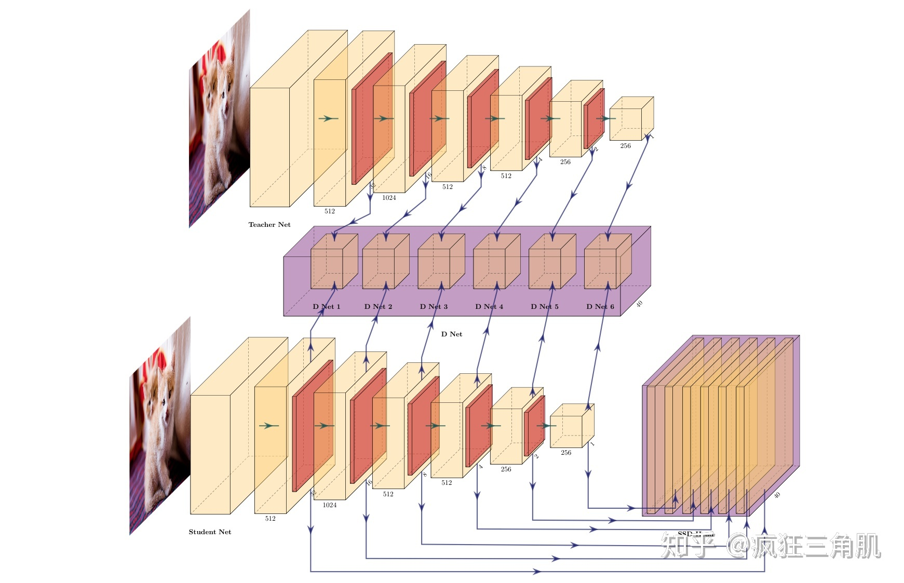
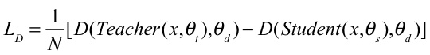

### GAN-Knowledge Distillation for One-Stage Object Detection

​                                                                      疯狂三角肌  

​                                                                    StartDt AI Lab  

#### **Method**

我们采用一步目标检测算法SSD作为我们的目标检测算法,SSD目标检测算法结构主要分成两部分，1）骨架网络,作为特征提取器。2）Head,在骨架网络提取的特征上，检测出目标的类别和位置。为了能获取更好的知识蒸馏效果，合理利用这个两个部分至关重要。

#####  Overall Structure

fig 1为我们算法模型的整体结构，我们首先使用一个容量更大的SSD模型，在充分训练后将该SSD模型拆分成骨架网络和SSD-Head，其中骨架网络作为teacher net，然后再挑选一个容量较小的CNN作为student net。我们把teacher net生成的多个feature map作为true sample，而student net生成的多个feature map作为fake sample，并且将true sample和fake sample送入D Net中相对应的每个判别网络(fig 2)中，同时把fake sample输入到SSD-Head中。

**Figure 1:**Teacher Net和 SSD-Head分别为容量更大并且充分训练后的SSD模型的骨架网络和头部网络。Student Net为一个容量较小的网络。D Net为多个6个小型判别网络组成的模块。

**Figure 2:**为D-Net模块中其中一个判别网络，由多个下采样卷积层组成。

##### Training Process

模型训练主要分为两个阶段，第一阶段的训练过程主要是使用对抗生成网络(GAN)的训练方式，首先是训练D Net模块中每个判别网络去辨别输入的sample是true sample 还是fake sample，并且frozen teacher net 和student net的weights，然后是训练student net生成fake sample去欺骗D Net模块中每个判别网络，并且同时对student net和 SSD-Head进行正常的SSD训。在训练过程中frozen teacher net 和D Net模块中每个判别网络的weights，如下面的公式。

##### Results

我们的脚本工具为gluoncv，和mxnet。训练机器为4个1080ti。将原生的SSD和在不同的Teacher net下知识蒸馏的SSD做比较，最高可以提升student net 2.8mAP。不过有趣的是，当teacher net为ResNet101，student net为ResNet18时，提升的效果反而不如ResNet50。后面发现在gluoncv上ssd_ResNet101,发现其效果在voc上的mAP只有79+，而ssd_ResNet50mAP达到80+。由于COCO数据集实在庞大，由于硬件资源有限训练一个模型需要一周时间，所以只用ResNet50作为Teacher Net(如果有的小伙伴有更多的硬件资源，可以尝试使用SSD+FPN作为Teacher Net，也可以将本方法迁移到Faster RCNN等一切端到端的深度学习方法上进行测试，相信会有意想不到的结果。～_～训练了好几个月才这些结果)。

| Student net | Teacher net                                     | Pascal Voc 2007 test                     |
| :---------- | :---------------------------------------------- | ---------------------------------------- |
| MobilenetV1 | - VGG16 ResNet50 ResNet101  | 75.4 77.3 77.7 77.6  |
| MobilenetV2 | - VGG16 ResNet50 ResNet101  | 75.9 77.2 77.7 77.5  |
| ResNet18    | - VGG16 ResNet50 ResNet101  | 74.8 77.2 77.6 77.3  |

Table 1. 不同的student net在不使用对抗知识蒸馏和使用对抗知识蒸馏在不同大小的teacher net的测试结果。训练sets为Pascal Voc 2007 and Pascal Voc 2012 trainval，测试sets为Pascal Voc 2007 test。

| Student net      | Teacher net           | COCO Val 2017        |
| :--------------- | :-------------------- | -------------------- |
| MobilenetV1_0.75 | - ResNet50  | 18 23      |
| MobilenetV1      | - ResNet50  | 21.7 25.4  |
| MobilenetV2      | - ResNet50  | 22 24.6    |

Table 2. 使用COCO train 2017作为训练集，COCO val 2017作为测试集。

以上就是本方法的的结果报告，现在正在假如cosine attention机制目前在voc上所有的模型都可以提提升接近1个mAP，目前正在coco上实验。

